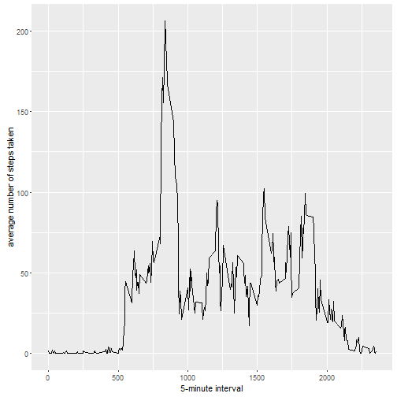

# Peer Assessment 1 for Reproducible Research 

## Loading and preprocessing the data


```r
activity.csv <- read.csv("repdata_data_activity/activity.csv")
head(activity.csv)
```

```
##   steps       date interval
## 1    NA 2012-10-01        0
## 2    NA 2012-10-01        5
## 3    NA 2012-10-01       10
## 4    NA 2012-10-01       15
## 5    NA 2012-10-01       20
## 6    NA 2012-10-01       25
```

## What is mean total number of steps taken per day?


```r
# Make a histogram of the total number of steps taken each day
stepsByDay <- tapply(activity.csv$steps, activity.csv$date, sum, na.rm=TRUE)
qplot(stepsByDay, xlab='Total steps per day', ylab='Frequency', binwidth=500)
```

 

```r
# Calculate and report the mean and median total number of steps taken per day
mean(stepsByDay, na.rm = TRUE)
```

```
## [1] 9354.23
```

```r
median(stepsByDay, na.rm=TRUE)
```

```
## [1] 10395
```

## What is the average daily activity pattern?


```r
# Make a time series plot (i.e. type = "l") of the 5-minute interval (x-axis) and the average number of steps taken, averaged across all days (y-axis)
AveStepsPerInt <- aggregate(x=list(steps=activity.csv$steps), by=list(interval=activity.csv$interval),
                      FUN=mean, na.rm=TRUE)
ggplot(data=AveStepsPerInt, aes(x=interval, y=steps)) +
    geom_line() +
    xlab("5-minute interval") +
    ylab("average number of steps taken")
```

 

```r
# Which 5-minute interval, on average across all the days in the dataset, contains the maximum number of steps?
AveStepsPerInt[which.max(AveStepsPerInt$steps),]
```

```
##     interval    steps
## 104      835 206.1698
```


## Imputing missing values

```r
# Calculate and report the total number of missing values in the dataset (i.e. the total number of rows with NAs)
table(is.na(activity.csv$steps))
```

```
## 
## FALSE  TRUE 
## 15264  2304
```

```r
# Devise a strategy for filling in all of the missing values in the dataset. The strategy does not need to be sophisticated. For example, you could use the mean/median for that day, or the mean for that 5-minute interval, etc.
# Strategy: Replace each missing value with the mean value of its 5-minute interval
fill.value <- function(steps, interval) {
    filled <- NA
    if (!is.na(steps))
        filled <- c(steps)
    else
        filled <- (AveStepsPerInt[activity.csv$interval==interval, "steps"][1])
    return(filled)
}

# Create a new dataset that is equal to the original dataset but with the missing data filled in.
activity_RpldNA <- activity.csv
activity_RpldNA$steps <- mapply(fill.value, activity_RpldNA$steps, activity_RpldNA$interval)
table(is.na(activity_RpldNA$steps))
```

```
## 
## FALSE 
## 17568
```

```r
# Make a histogram of the total number of steps taken each day and Calculate and report the mean and median total number of steps taken per day. Do these values differ from the estimates from the first part of the assignment? What is the impact of imputing missing data on the estimates of the total daily number of steps?
stepsByDay_activity_RpldNA <- tapply(activity_RpldNA$steps, activity_RpldNA$date, sum)
qplot(stepsByDay_activity_RpldNA, xlab='Total steps per day', ylab='Frequency', binwidth=500)
```

 

```r
mean(stepsByDay_activity_RpldNA)
```

```
## [1] 10766.19
```

```r
median(stepsByDay_activity_RpldNA)
```

```
## [1] 10766.19
```

```r
# compare to raw results (without replacing NA values)
qplot(stepsByDay, xlab='Total steps per day', ylab='Frequency', binwidth=500)
```

 

```r
mean(stepsByDay)
```

```
## [1] 9354.23
```

```r
median(stepsByDay)
```

```
## [1] 10395
```

Impact of replacing NA's: 
* mean & median are higher
* total number of steps per day is higher since NA values are considered as 0 for summing up totals 
* in histogram less 0 values due to replacement of NA values


## Are there differences in activity patterns between weekdays and weekends?

```r
# Create a new factor variable in the dataset with two levels -- "weekday" and "weekend" indicating whether a given date is a weekday or weekend day.
weekday.or.weekend <- function(date) {
    day <- weekdays(date)
    if (day %in% c("Montag", "Dienstag", "Mittwoch", "Donnerstag", "Freitag"))
        return("weekday")
    else if (day %in% c("Samstag", "Sonntag"))
        return("weekend")
    else
        stop("invalid date")
}
activity_RpldNA$date_new <- as.Date(activity_RpldNA$date)
activity_RpldNA$day <- sapply(activity_RpldNA$date_new, FUN=weekday.or.weekend)

# Make a panel plot containing a time series plot (i.e. type = "l") of the 5-minute interval (x-axis) and the average number of steps taken, averaged across all weekday days or weekend days (y-axis).
AveStepsPerIntDay <- aggregate(steps ~ interval + day, data=activity_RpldNA, mean)
ggplot(AveStepsPerIntDay, aes(interval, steps)) + geom_line() + facet_grid(day ~ .) +
    xlab("5-minute interval") + ylab("Number of steps")
```

 


